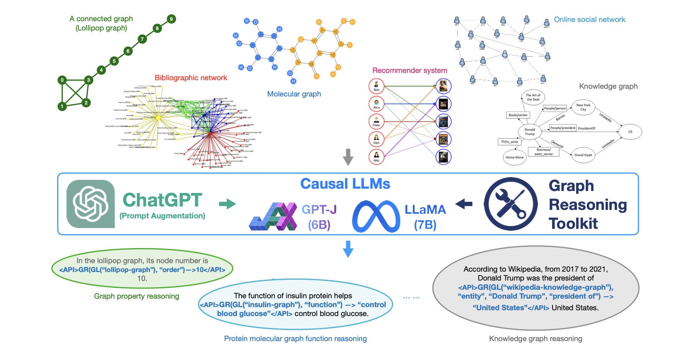

# Graph-ToolFormer: To Empower LLMs with Graph Reasoning Ability via Prompt Dataset Augmented by ChatGPT

Abstract: In this paper, we aim to develop a large language model (LLM) with the reasoning ability on complex graph data. Currently, LLMs have achieved very impressive performance on various natural language learning tasks, extensions of which have also been applied to study the vision tasks with multi-modal data. However, when it comes to the graph learning tasks, existing LLMs present very serious flaws due to their several inherited weaknesses in performing multi-step logic reasoning, precise mathematical calculation and perception about the spatial and temporal factors.

To address such challenges, in this paper, we will investigate the principles, methodologies and algorithms to empower existing LLMs with graph reasoning ability, which will have tremendous impacts on the current research of both LLMs and graph learning. Inspired by the latest ChatGPT and Toolformer models, we propose the Graph-ToolFormer (Graph Reasoning oriented Toolformer) framework to teach LLMs themselves with prompts augmented by ChatGPT to use external graph reasoning API tools. Specifically, we will investigate to teach Graph-ToolFormer to handle various graph data reasoning tasks in this paper, including both (1) very basic graph data loading and graph property reasoning tasks, ranging from simple graph order and size to the graph diameter and periphery, and (2) more advanced reasoning tasks on real-world graph data, such as bibliographic networks, protein molecules, sequential recommender systems, social networks and knowledge graphs. 

Technically, to build Graph-ToolFormer, we propose to handcraft both the instruction and a small-sized of prompt templates for each of the graph reasoning tasks, respectively. Via in-context learning, based on such instructions and prompt template examples, we adopt ChatGPT to annotate and augment a larger graph reasoning statement dataset with the most appropriate calls of external API functions. Such augmented prompt datasets will be post-processed with selective filtering and used for fine-tuning existing pre-trained causal LLMs, such as the GPT-J, to teach them how to use graph reasoning tools in the output generation. To demonstrate the effectiveness of Graph-ToolFormer, we conduct some preliminary experimental studies on various graph reasoning datasets and tasks, and will launch a LLM demo online with various graph reasoning abilities.

# Submission Records to Arxiv (Screenshot at April 11)

