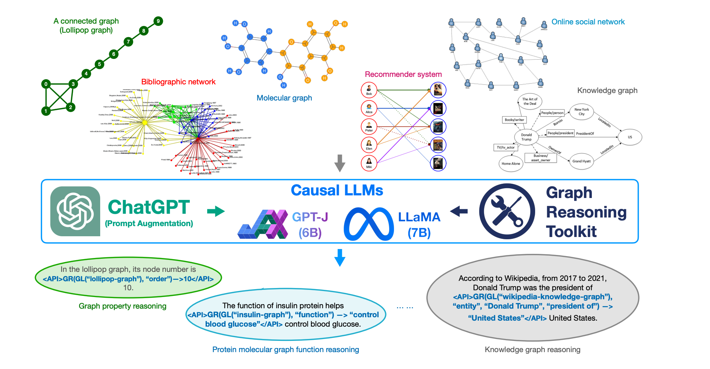
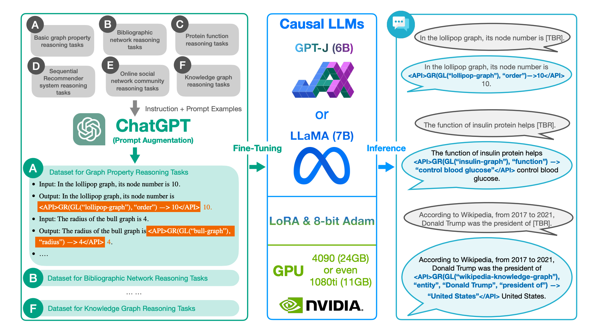
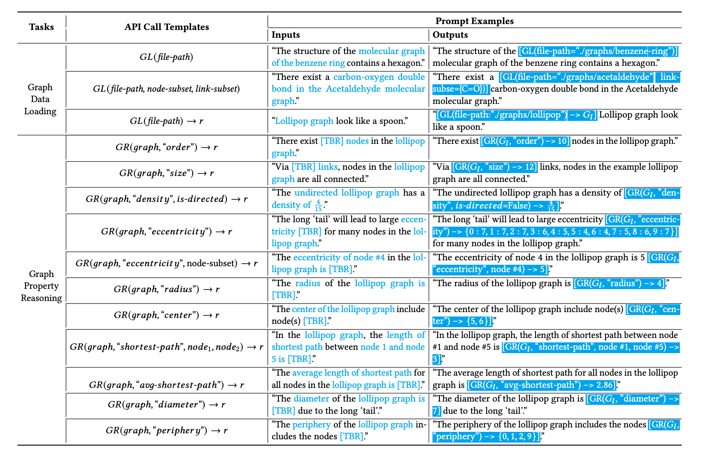
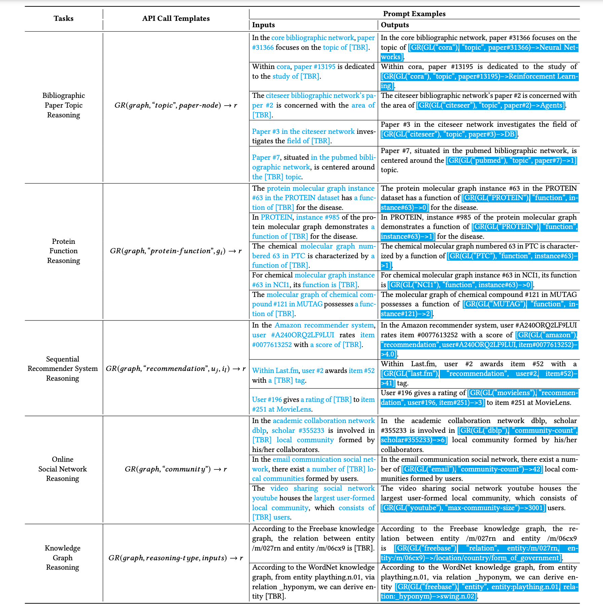

（欢迎转载）

## 论文标题
#### Graph-ToolFormer: To Empower LLMs with Graph Reasoning Ability via Prompt Augmented by ChatGPT

## 论文和源码下载链接
#### 文章： http://www.ifmlab.org/files/paper/graph_toolformer.pdf
#### 代码： https://github.com/jwzhanggy/Graph_Toolformer

## 背景介绍
最近几年，大语言模型（LLM）在自然语言处理的各类任务上都取得了非常优异的表现。并且，自从2022年底到现在，ChatGPT 和 New Bing Chat 相继出现以后，各种大语言模型被广泛应用到人们的学习、工作和生活当中，对我们的工作生活都产生了巨大的影响。

与此同时，在使用过程中，大语言模型的自带的诸多弊端也显现出来，包括（1）**无法做复杂精确的数学计算**，（2）**没法进行多步的逻辑推理**，（3）**不能获得空间拓扑结构信息**，（4）**难以准确感知时间信息** 等。

在现实生活中，除了文本数据外，还广泛存在各种其他类型的数据，例如 image 和 graph 等类型的数据。现在，把 LLM 扩展能够处理多模态数据是当前研究的重点，并且 OpenAI 最新的 GPT4 和 Google 新推出的 PaLM-E 都能够同时有效处理文字和图片 (image) 等数据。而如何使用LLM处理复杂的 graph 结构的数据，当前还是一个有待解决的问题。

## 研究问题

在现实生活中，很多数据都可以表示成 graph 结构数据。例如上图所示：

- 学术文献引用关系可以表示成 bibliographic network
- 生物医学里的蛋白质分子可以表示成 protein molecular graph
- 推荐系统可以表示成包括人和物品关系的 recommender system network
- 社交网络可以表示成包含用户和人际关系的  online social network
- 无结构的复杂文本数据也可表示成由 entity 和 relation 构成的 knowledge graph 等

本文主要研究如何使用LLM处理 graph 结构数据，并且进行复杂 graph 数据上的推理问题，其中包括

- 简单 graph 的**基本属性**，例如：
	* 半径，密度，最短路径 等；
- 复杂 graph 数据上的**应用任务**，例如：
	* 基于 bibliographic network 的文献主题预测，
	* 基于 protein molecular graph 的蛋白质分子功能检测，
	* 基于 recommender system network 的时序商品推荐，
	* 基于 online social network 的社区检测，
	* 基于 knowledge graph 的知识图谱推理 等。
	
上面这些 graph 结构数据上的推理任务往往都涉及 (1) 复杂的数学计算，(2）多步逻辑推理，(3) 处理空间拓扑结构，(4) 感知时序信息 等。而这些对模型的要求，正好对应了前面提到的 LLM 的诸多弱点。

## 解决方案

为了解决这些问题，并且使得 LLM 能够在 graph 结构数据上进行各种复杂推理的任务，基于最近的 ChatGPT 和 Toolformer 模型，本文提出了一个新的语言模型框架，Graph-Toolformer。Graph-Toolformer 针对各类 graph reasoning 任务，定义了对应的 API call，并且通过使用 LLM 生成 API call 来使用 LLM 控制和实现针对各类 graph 数据的 reasoning task。

如上图所示，本文提出的 Graph-Toolformer 包含多个功能模块：

0. **针对 graph reasoning 任务设计少量 API Call 样本:** 我们针对本文研究的 graph reasoning 任务设计了少量的 API call 样本，通过 API call 我们既可以加载 graph 数据，也可以对 graph 数据进行简单和复杂的推理任务。

1. **基于 ChatGPT 对 prompt 进行 augmentation:** 基于上一步的少量 API call prompt 样本，我们提出使用 ChatGPT 对训练数据进行增强。基于人工设计的 instruction 和少量 prompt example 数据，我们调用 ChatGPT API 利用 GPT3.5/GPT4 的 in-context learning 和 few-shot learning 的特性，成功对各类 graph reasoning 任务各自生成了一个比较大的训练数据，并对生成的数据进行了清洗和整理。

2. **使用现有 pre-train LLM 进行模型 fine-tuning:** 基于得到的训练数据，我们对现有 pre-train 的开源 causalLM 模型 （例如 GPT-J 6B 和 LLaMA 7B）进行 fine-tuning。为了降低模型训练的内存开销，本位使用了最新的 LoRA，大预言模型 quantization 技术，并且使用了 bitsandbyte 的 8bit AdamW 作为训练使用的 optimizer。本文模型的 fine-tuning 任务，在使用小的 batch-size 的情况下，最低仅仅需要 11GB 显存，完全可以在 1080Ti 的显卡上跑 fine-tuning。

3. **基于 external graph toolkits 的 graph reasoning:** 训练好的 LLM 可以对任意 graph reasoning 的输入，自动插入并生成对应含有 API call 的输出。并且通过 post-processing，我们可以调用外部的 graph reasoning 工具包，实现 API call 并且把返回结构加入的生成结构之中，实现使用 LLM 对 graph 结构数据进行复杂推理的任务。

## Graph Reasoning Prompt 示例
如下面两个表所示，我们展示了各种简单和复杂 graph reasoning prompt input-output 的示例。

- graph 数据加载和简单 graph property reasoning 示例：

- 复杂 graph reasoning 任务示例：

## 实验结果

本文选取了多个 graph reasoning 的 benchmark 数据集，对 Graph-Toolformer 框架的表现进行验证，如下表所示：

- 各种 graph benchmark 数据集：

- fine-tuning 后的模型生成的输出质量：

## 结论和后续工作
本文提出了通用的 Graph-ToolFormer 框架，实现了使用 LLM 来完成 graph reasoning 的任务。目前 Graph-ToolFormer 还只包含 GPT-J 一个语言模型和文中提到的少量 graph reasoning 任务。根据作者最新信息，他们将会继续向 Graph-ToolFormer 添加跟多的语言模型，graph data 和 graph reasoning 任务，并且会将 Graph-ToolFormer 上线且增加 GUI，使得用户可以在线完成各类型的 graph reasoning 任务。
